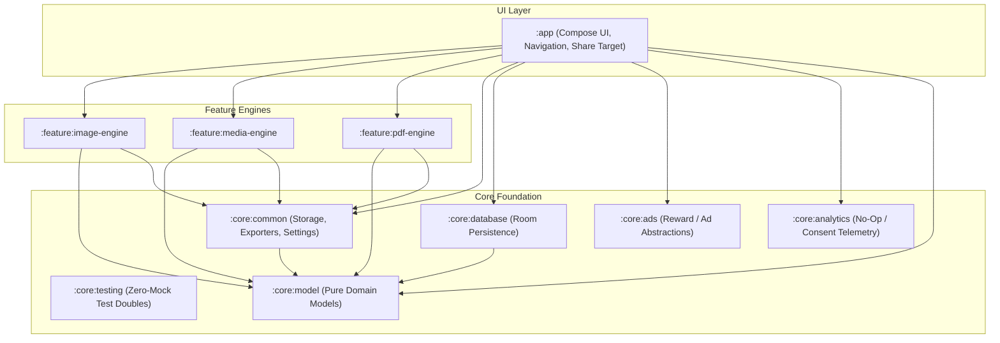

<div align="center">

# ⚡ TapConvert

### The lightning-fast, 100% offline media compressor & converter for Android.

**Resize photos to exact KB for government portals • Squash videos for Discord & WhatsApp • Extract MP3s • Convert PDFs**  
*No cloud uploads. No subscriptions. No ads selling your data. Completely open-source.*

<br/>

[](https://opensource.org/licenses/MIT)
[](https://kotlinlang.org)
[-3DDC84?style=for-the-badge&logo=android&logoColor=white)](https://developer.android.com)
[](https://developer.android.com/jetpack/compose)
[](#-100-offline--privacy-first)
[](https://github.com/theGoodB0rg/tap-convert/pulls)

<br/>

[**⭐ Star this repo on GitHub**](https://github.com/theGoodB0rg/tap-convert) — *It helps more people discover free, private media tools!*

</div>

---

## 🧐 Why TapConvert?

Ever had Discord tell you **"Your file is too powerful (Max 25MB)"**? Or tried uploading an ID picture to a government portal that demands **"File must be strictly under 200KB"**?

Most online converters force you to upload your personal photos and videos to remote servers, queue in lines, or pay weekly subscriptions. **TapConvert does all the heavy lifting locally on your device in seconds.**

| Feature | Shady Web Converters 🌐 | Generic Ad-Filled Apps 📱 | **TapConvert ⚡** |
| :--- | :---: | :---: | :---: |
| **Privacy & Security** | Uploaded to third-party servers | Loaded with trackers | **100% On-Device & Offline** |
| **File Size Limits** | 5MB – 15MB caps | Requires Pro tier | **Unlimited (Hardware capacity)** |
| **1-Tap Quick Presets** | ❌ (Manual sliders only) | ❌ (Confusing menus) | **✅ Discord, WhatsApp, Gov ID, etc.** |
| **System Share Sheet** | ❌ (Must open browser) | ⚠️ (Hit or miss) | **✅ 1-Tap Convert from any app** |
| **Cost & Watermarks** | Watermarks / Subscriptions | Annoying video ads | **100% Free & Open Source (MIT)** |

---

## ✨ Superpowers & 1-Tap Presets

### 📸 1. Image Compressor & Resizer
* **Exact Size Targeting**: Target `< 50KB`, `< 100KB`, or `< 200KB` for passport photos, visa applications, and job portals.
* **Modern Web Formats**: Transcode between **WebP**, **JPEG**, **PNG**, and **HEIC** with intelligent quality preservation.
* **Resolution Scaling**: Scale dimensions proportionally (1080p, 720p, or custom pixel dimensions).

### 🎬 2. Video Compressor & Optimizer
* **Discord Preset**: Compress clips down to **8MB**, **25MB**, or **50MB** for free Discord sharing with crisp audio.
* **WhatsApp Preset**: Squash lengthy recordings to **16MB** or **64MB** without stutter.
* **Email Attachment**: Instantly compress attachments to fit within standard **25MB** email caps.
* **Quality Tuning**: Choose between High, Balanced, and Maximum Compression modes.

### 🎵 3. Audio Extractor & Transcoder
* **Extract Audio from Video**: Pull crisp audio tracks from MP4, MKV, MOV, or WEBM in 1 tap.
* **Format Flexibility**: Output to universal **MP3**, **M4A (AAC)**, or **WAV**.
* **Bitrate Control**: Select 128 kbps (speech/podcasts), 192 kbps (standard music), or 320 kbps (studio fidelity).

### 📄 4. PDF Converter & Image Stitcher
* **Images to PDF**: Combine multi-page receipts, notes, and photos into a clean, searchable PDF document.
* **PDF to Image Extractor**: Extract high-resolution image pages (JPEG/PNG) from PDF files for easy sharing.

---

## 🚀 Instant Share Sheet Integration

You don't even need to open the app! 

1. Select any photo or video in your **Gallery**, **TikTok**, **Instagram**, or **Files** app.
2. Tap **Share** ➔ choose **TapConvert**.
3. Pick your desired preset (e.g., *WhatsApp 16MB* or *Passport 200KB*).
4. Tap **Convert & Share** — done in seconds!

---

## 🔒 100% Offline & Privacy-First

* **Zero Cloud Processing**: TapConvert functions completely offline without internet permissions.
* **Scoped Storage Compliant**: Uses modern Android `MediaStore` and `FileProvider` (`Pictures/TapConvert`, `Movies/TapConvert`, `Documents/TapConvert`).
* **Air-Gapped Friendly**: Works on flights, remote areas, or privacy-critical environments.

---

## 🏗️ Clean Modular Architecture

TapConvert is built using a modern **10-module clean architecture**, reactive Kotlin Flows, and Jetpack Compose Material 3:



### 🛠️ Tech Stack:
- **Language**: Kotlin 2.0+ (100%)
- **UI Framework**: Jetpack Compose + Material 3 + Material You Dynamic Theming
- **Architecture**: MVI / Clean Multi-Module Architecture
- **Asynchronous**: Kotlin Coroutines & StateFlow
- **Engines**: Android Graphics Bitmap / AndroidX Media3 / ExoPlayer / PdfRenderer / FFmpeg
- **Storage**: Room DB + Jetpack DataStore Preferences + Android MediaStore (Scoped Storage)
- **Testing**: Zero-mock contract test suite with JUnit 4, Google Truth, Turbine, and Coroutines Test

---

## 💻 Building Locally

### Prerequisites
* JDK 17 or JDK 21
* Android Studio Ladybug (or newer) / Android SDK (API 34/35)

### Quick Commands:
```bash
# 1. Clone the repository
git clone https://github.com/theGoodB0rg/tap-convert.git
cd tap-convert

# 2. Run all unit tests across all 10 modules
./gradlew testDebugUnitTest

# 3. Assemble and install Debug APK to your connected phone
./gradlew installDebug
```

---

## 🗺️ Roadmap & Upcoming Features

- [x] Android 10–14 Scoped Storage & MediaStore Auto-Export
- [x] Secure `FileProvider` share intent pipeline
- [x] In-app Settings, SAF Custom Folder selection & Privacy Policy
- [x] 1-Tap Share Sheet target bottom sheet
- [ ] Batch processing queue for bulk files
- [ ] Custom FFmpeg parameter editor for advanced power users
- [ ] Home screen Quick Action Widgets

---

## 🤝 Contributing

Contributions make the open-source community an amazing place to learn and build! Any contributions you make are **greatly appreciated**.

1. Fork the Project
2. Create your Feature Branch (`git checkout -b feature/AmazingPreset`)
3. Commit your Changes (`git commit -m 'feat: add custom Instagram Reels preset'`)
4. Push to the Branch (`git push origin feature/AmazingPreset`)
5. Open a Pull Request

---

## 📄 License

Distributed under the **MIT License**. See [`LICENSE`](LICENSE) for more information.

<div align="center">

Made with ❤️ for privacy, speed, and simplicity.  
**If you find TapConvert helpful, please consider giving it a ⭐!**

</div>
